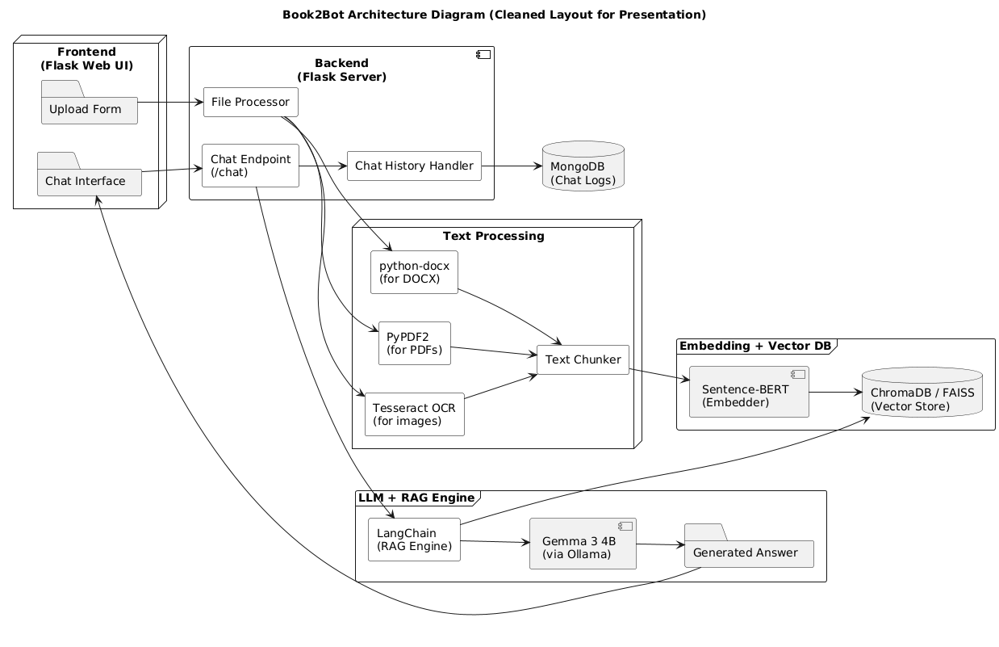
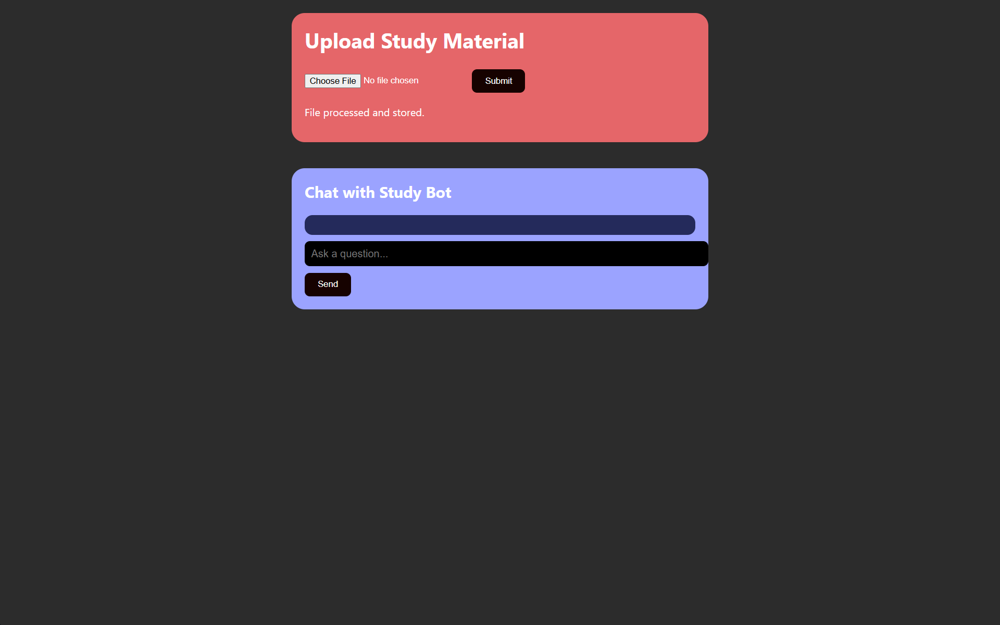
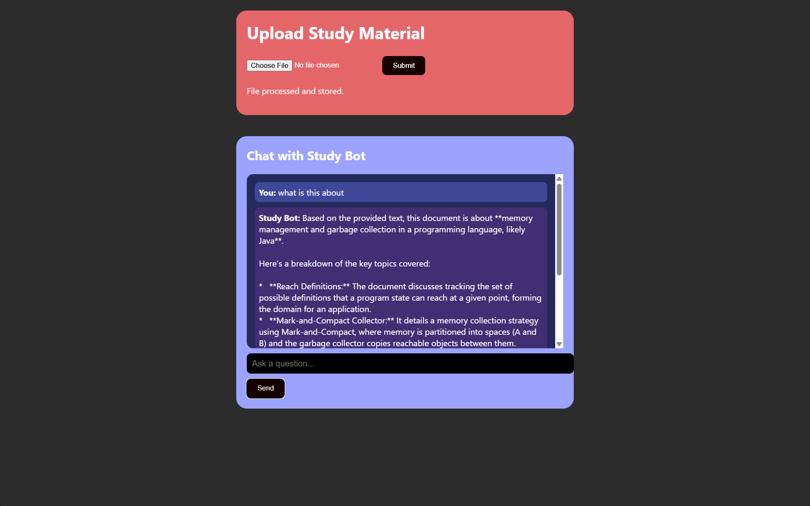

# 📚 Book2Bot — AI Chatbot for Any Book or Notes

> **Empowering students to turn their study materials into an AI tutor.**

---

## 🧠 Overview

**Book2Bot** is an AI-powered chatbot that converts any textbook, handwritten notes, or academic PDFs into an intelligent, interactive tutor. Designed to make learning smarter and more engaging, Book2Bot leverages **semantic search**, **OCR**, and **Retrieval-Augmented Generation (RAG)** to deliver highly personalized, context-aware responses based on user-uploaded content.

Whether you're preparing for exams or doing self-paced study, Book2Bot transforms static material into a dynamic learning experience.

---

## 🚀 Features

- 📄 **Upload Your Own Notes:** Supports PDF, DOCX, and scanned handwritten files (via OCR).
- 🧠 **Semantic Search:** Uses Sentence-BERT to embed and retrieve contextually relevant content.
- 🤖 **Custom LLM Response Generation:** Utilizes a fine-tuned LLM (Gemma 3 4B via Ollama) for accurate, educational responses.
- 🔍 **Interactive Learning:** Ask questions, get summaries, or quiz yourself.
- 💬 **Flask Web Interface:** Simple UI for chatting and uploading materials.
- 🛠️ **Modular Architecture:** Clear separation between frontend, backend, and vector-based retrieval.

---

## 🏗️ System Architecture



> **Key Components:**
> - **Frontend (Flask):** Upload form + chat interface.
> - **Backend (Flask):** Handles file parsing, chat logic, and logging.
> - **Processing Modules:** PyPDF2, `python-docx`, and Tesseract OCR.
> - **Embedding & Vector DB:** Sentence-BERT + FAISS/ChromaDB.
> - **LLM + RAG Engine:** LangChain + Ollama (Gemma 3 4B).

---

## ⚙️ Installation

### 1. Clone the repository

```bash
git clone https://github.com/SRB1025X/Book2Bot.git
cd Book2Bot
```

### 2. Install dependencies

Make sure you have Python ≥ 3.8 and virtualenv installed.

```bash
pip install -r requirements.txt
```

### 3. Install Tesseract OCR

- **Ubuntu/Debian:**
  ```bash
  sudo apt install tesseract-ocr
  ```
- **Windows:**  
  Download from [Tesseract GitHub](https://github.com/tesseract-ocr/tesseract)

### 4. Run Ollama with Gemma 3B

```bash
ollama run gemma:3b
```

---

## 💻 Running the App

```bash
python app.py
```

The Flask server will run on `http://localhost:5000`.  
Open it in your browser and upload your material to start chatting!

---

## 🛠️ Tech Stack

| Category              | Tool/Library                           |
|----------------------|----------------------------------------|
| **Frontend**         | Flask (HTML, JS, CSS)                  |
| **Backend**          | Flask, LangChain                       |
| **LLM**              | Gemma 3 4B via Ollama                  |
| **Embedding**        | Sentence-BERT (all-MiniLM-L6-v2)       |
| **Vector DB**        | FAISS or ChromaDB                      |
| **OCR**              | Tesseract                              |
| **Document Parsing** | PyPDF2, python-docx                    |
| **Database**         | MongoDB or SQLite                      |

---

## 📸 Screenshots

| Upload Interface | Chat Interface |
|------------------|----------------|
|  |  |

---

## 👩‍💻 How It Works

1. **Upload** PDF, DOCX, or scanned notes.
2. **Parse** with PyPDF2/Docx/Tesseract.
3. **Chunk & Embed** using Sentence-BERT.
4. **Store** embeddings in ChromaDB or FAISS.
5. **Query** via RAG pipeline using LangChain.
6. **Generate Response** from Gemma 3 4B (via Ollama).

---

## 📚 References

- **Sentence-BERT**: Reimers, N., & Gurevych, I. (2019). [Sentence-BERT: Sentence Embeddings using Siamese BERT-Networks](https://arxiv.org/abs/1908.10084)
- **LangChain**: [LangChain Documentation](https://docs.langchain.com/)
- **Retrieval-Augmented Generation**: Lewis, P., et al. (2020). [Retrieval-Augmented Generation for Knowledge-Intensive NLP Tasks](https://arxiv.org/abs/2005.11401)
- **Tesseract OCR**: [Tesseract OCR GitHub](https://github.com/tesseract-ocr/tesseract)
- **FAISS**: Johnson, J., Douze, M., & Jégou, H. (2017). [FAISS: Facebook AI Similarity Search](https://github.com/facebookresearch/faiss)
- **Gemma Models & Ollama**: [Gemma by Google](https://ai.google.dev/gemma) | [Ollama Docs](https://ollama.com/library/gemma)

---

## 📃 License

MIT License. See [`LICENSE`](LICENSE) for details.
